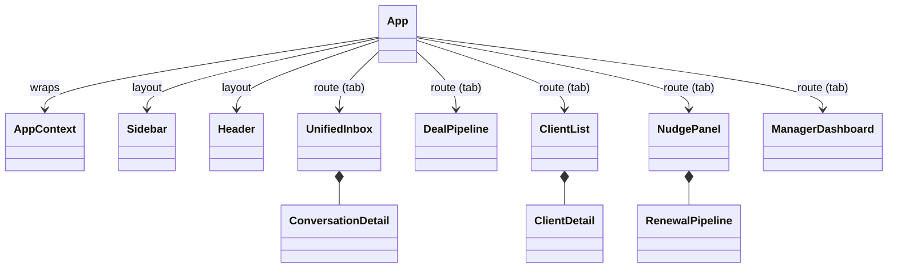
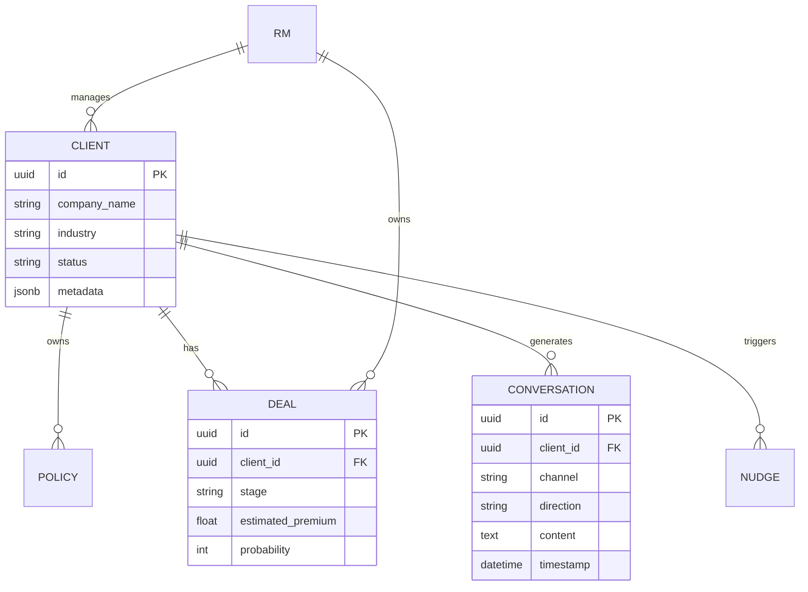

# System Architecture: BimaKavach RM Copilot

## 1. High-Level Architecture Overview

The RM Copilot is designed as a unified communication and intelligence layer that sits between the client communication channels (WhatsApp, Email, Telephony) and the core CRM.

```mermaid
graph TD
    subgraph Client Communication Channels
        WA[WhatsApp Business API]
        EM[Email Integration]
        PH[Telephony/CloudTalk]
    end

    subgraph BimaKavach RM Copilot (Frontend)
        UI[Unified Inbox UI]
        CRM[AI-Assisted CRM UI]
        NE[Nudge Engine UI]
        DB[Manager Dashboard]
        
        UI <--> State[Global App Context]
        CRM <--> State
        NE <--> State
        DB <--> State
    end

    subgraph Intelligence Layer
        AI[AI Simulator / NLP Engine]
        Rules[Coverage Matrix Rules]
    end

    subgraph Core Backend (Proposed Phase 2)
        Supa[(Supabase PostgreSQL)]
        Auth[Authentication]
    end

    WA --> UI
    EM --> UI
    PH --> UI

    State <--> AI
    State <--> Rules
    
    State -.-> Supa
```

## 2. Frontend Architecture (React + Vite)

The frontend is a Single Page Application (SPA) built with React and Vite. It is designed to be highly responsive, offline-tolerant, and real-time capable.

### Core Modules
* **Context Provider (`AppContext.jsx`)**: Manages the global state of the application, including selected clients, active tabs, conversation histories, and UI toggles.
* **Mock Data Layer (`mockData.js`)**: Currently serves as the simulated backend, providing realistic Indian insurance data (Clients, Policies, Deals, Conversations, Nudges).
* **AI Simulator (`aiSimulator.js`)**: Simulates the intelligence layer entirely within the browser. It detects CRM stage transitions based on keyword heuristics and generates contextual deal notes.
* **Coverage Matrix (`coverageMatrix.js`)**: A rule-based engine that maps industries to essential, recommended, and optional insurance products to identify portfolio gaps.

### Component Structure


## 3. Data Architecture (Proposed Backend)

For Phase 2 (Supabase Integration), the data model will follow this relational structure:



## 4. Design System & Theming

The application utilizes a custom CSS-variable-based design system (`design-system.css`) emphasizing a premium, dark-mode-first aesthetic.
- **Tokens**: Colors, typography, spacing, and shadows are strictly controlled via CSS variables.
- **Glassmorphism**: Subtle translucent backgrounds with background-blur are used for overlays (e.g., Call Simulator).
- **Micro-animations**: Staggered fade-ins and interactive hover states ensure a dynamic and responsive feel.
