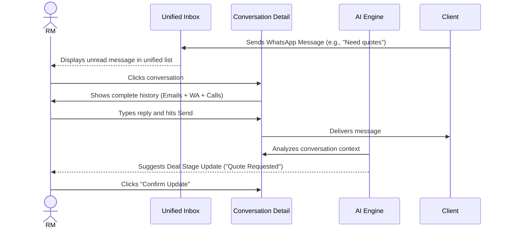
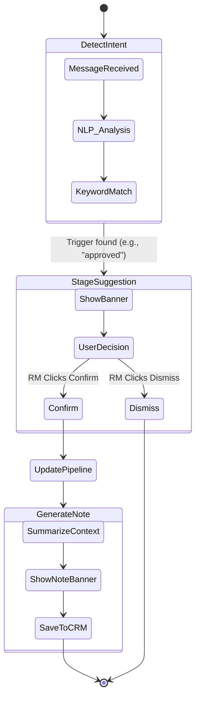
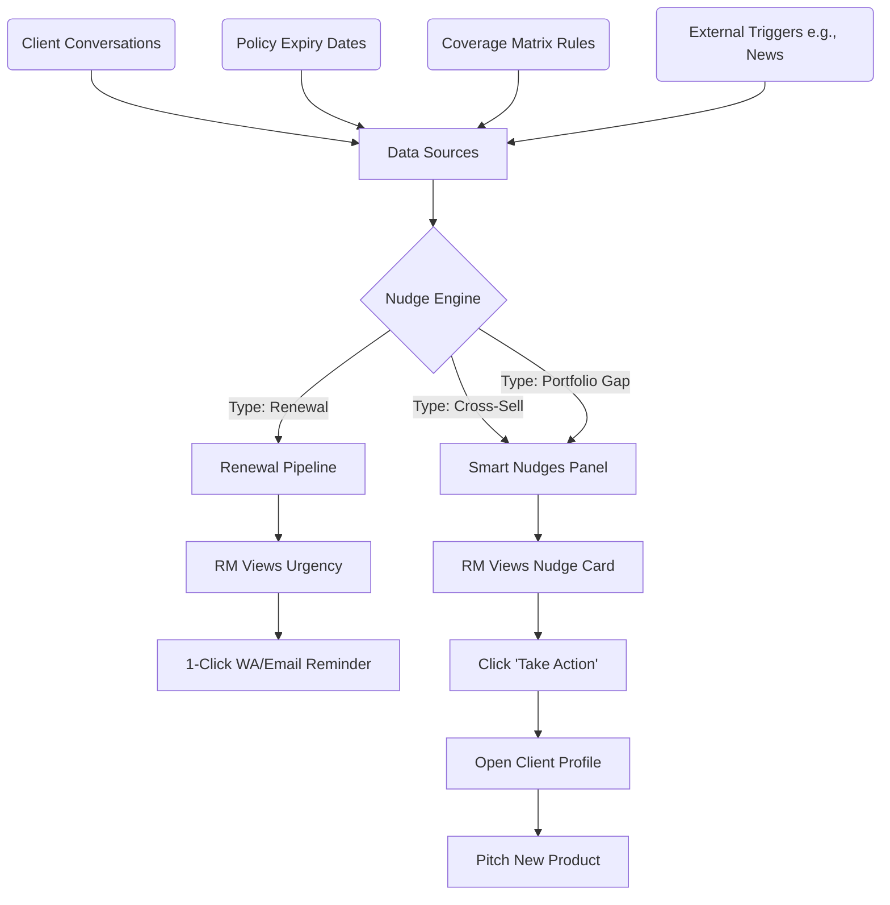
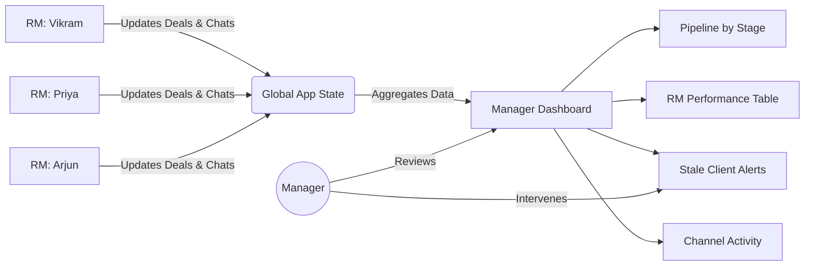

# User Journeys & Flows: BimaKavach RM Copilot

This document outlines the primary workflows for Relationship Managers (RMs) using the BimaKavach RM Copilot.

## 1. The Unified Communication Flow

**Goal:** The RM handles all client communication (WhatsApp, Email, Calls) from a single interface without context switching.

## 2. AI-Assisted CRM Update Flow

**Goal:** Reduce manual data entry by automatically detecting stage changes and generating deal notes from natural conversations.

## 3. The Nudge Engine & Renewal Flow

**Goal:** Proactively surface revenue opportunities (cross-sells, upsells) and prevent churn (renewals).

## 4. Manager Dashboard & Analytics Flow

**Goal:** Provide sales leaders with real-time visibility into pipeline health and RM performance without requiring manual status reports.

